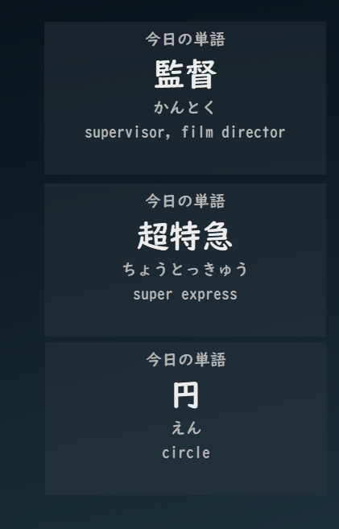

# JP Word Of The Day

## Features

- Multiple windows
- Saving window state
- Reloading of styles
- Locking and dragging of windows
- Accepts any arbitrary csv data

## Description

A simple widget made with pyqt that displays a random word from a core 10k deck.
Pull requests are welcome, I don't plan to work on this project a lot.

## Controls

- Ctrl + N: Spawn a new window
- Escape: Close the program
- Ctrl + W: Close the window
- Ctrl + R: Reload from the config.yaml
- Ctrl + L: Lock and unlock the window to be dragged around
- Q: move to the previous word alternative for a window (up to 4)
- E: move to the next word alternative for a window (up to 4)

## Configuration

The project uses yaml for configuration. The config.yaml file is loaded from the same directory as the working directory of the executable.

## Dependencies

- Python 3
- PyQt6
- Pyyaml

## Setup

1. Clone the repository
2. Install python
3. Install the dependencies (`pip install pyqt6 pyyaml`)
4. Run the script (`build.sh` or `build.bat`)
